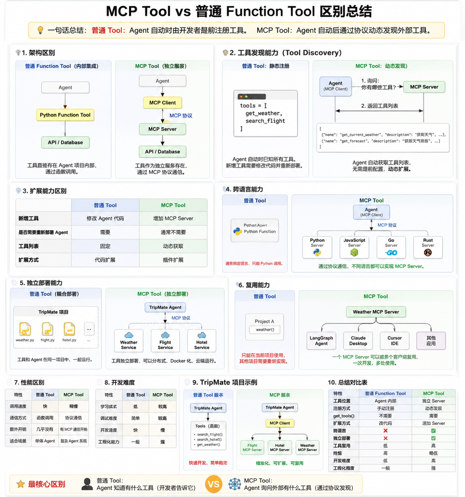
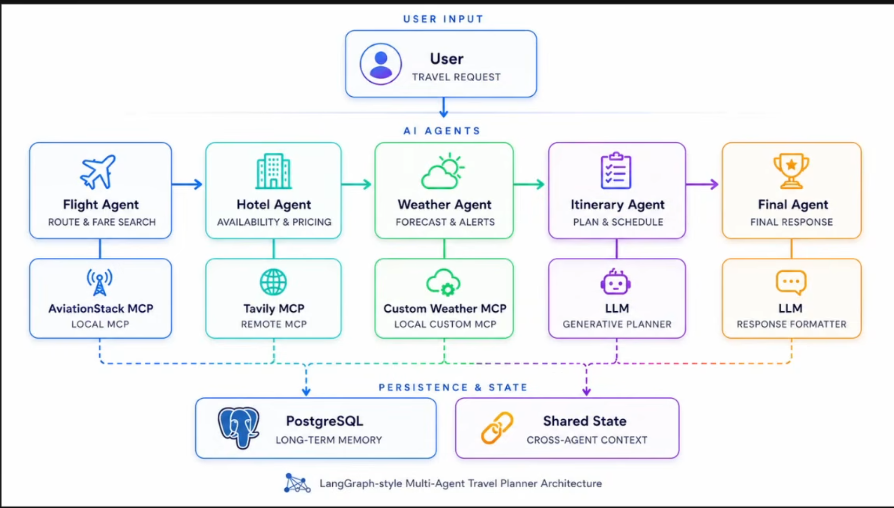

def 里面调用异步函数（async def）：使用asyncio.run()
异步函数（async def）调用异步函数（async def）：使用await

异步函数 async def 调用异步函数 async def不能使用：asyncio.run()，因为事件循环已经存在。想并发调用多个异步函数，可以使用asyncio.gather()
一个程序通常只有一个地方负责启动事件循环（asyncio.run），进入异步世界以后全部用 await。nest_asyncio可以处理多个事件循环。

